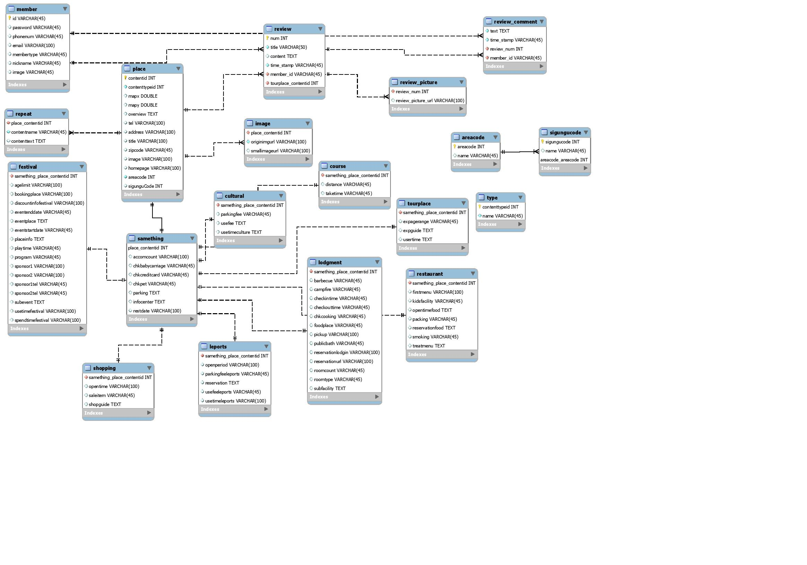

# 공수래 공수거 Final Project

### 1. 개요 및 역할

* **개요**
  * 급하게 어디론가 떠나고 싶거나 힐링하고 싶을 때 간편하게 내 주변에 있는 관광지를 확인하고 이용 가능 여부를 조회할 수 있는 웹 애플리케이션
* **역할분담**
  * Frontend: 오명현
  * Backend: 박한범, 김동욱, 정태현

### 2. 개발환경

* **언어**
  * `Java`
  * `HTML/CSS`, `JavaScript`
* **웹 프레임워크**
  *  `Spring Boot`
* **주요 라이브러리**
  *  `Vue.js`
  *  `Thymeleaf`
* **데이터베이스**
  *  `MySQL` 
* **배포**
  * `AWS`

### 3. 주요 페이지 구성

#### 1) `mainPage`

> 관광지를 조회할 수 있는 메인페이지

- 반경 ?km 선택 (1, 3, 5, 10km) / 이용시간 선택
- 시간에 따라 이용할 수 있는 관광지, 이용할 수 없는 관광지 구분해서 출력 **(X)**
- 정렬 옵션 (추천순, 댓글순 등)
- 리뷰 작성하기

#### 2) `placeDetail` 

> 관광지 상세정보를 조회하는 페이지

- 상세정보 구분해서 보여주기
- 리뷰 작성하기

#### 3) `myPage`

> 사용자 개인정보와 작성한 리뷰글을 확인할 수 있는 페이지

- 닉네임, 자기소개 (수정가능)
- 작성한 리뷰글 모아보기
  - 수정, 삭제기능

#### 4) `writeReview`

> 리뷰 작성하는 페이지

- 사진 첨부 
- 해시태그

#### 5) `reviewDetail` 

> 리뷰 게시글의 상세페이지

- 리뷰에 대한 댓글 (후순위)

#### 6) `adminPage`

> 관리자 페이지

- 사용자 권한 설정 및 강제탈퇴 관리

## 4. 데이터베이스 모델링

## 5. 개발 진행 경과사항

### 5-1. 19.07.29 ~ 19.08.02

#### Backend

- 데이터베이스 Seed Data 수집 및 구축
  - 개장/폐장시간 수집 로직 구현
- 사용자 인증 기능
  - 암호화
- 리뷰 CRUD 로직 구현

#### Frontend

- **메인 페이지** (`main.jsp`)
  - 기본 디자인 완성
  - 좌표 및 거리 설정에 따른 관광지 목록 출력
- **관광지 상세정보 페이지** (``placeDetail.jsp`)
  - 기본 디자인 완성

### 5-2. 19.08.05 ~ 19.08.09

#### Backend

* Seed Data 수집
  * 개장/폐장시간
* 사용자 인증 기능
  * 로그인 구현
  * 회원가입 구현
* API 연동
  * Google Maps

#### Frontend

* **메인 페이지**(`main.jsp`)
  * 사용자가 입력한 위치 및 거리정보에 따라 관광지 목록 출력하기 (백엔드 연동)
    * 원하는 위치(지도찍기?동으로 검색?) & 1~5km 거리 선택
  * 더보기 기능 (<u>구현 방법 조사 필요</u> -> `pagination` ?)
* **관광지 상세정보 페이지**(``placeDetail.jsp`)
  * Google Maps 연동해서 관광지 위치 보여주기
  * 작성된 리뷰 목록 보여주기
  * 작성된 리뷰 클릭해서 리뷰 상세정보 페이지 이동하기
* **리뷰 작성 페이지**(`writeReview.jsp`)
* **리뷰 상세정보 페이지** (`reviewDetail.jsp`)
* **마이페이지** (`myPage.jsp`)
  * ID, PW,  작성자 리뷰 목록
* **Admin 페이지** (`admin.jsp`)
  * 유저 리스트 출력
  * 유저 -> 관리자 권한부여

* **로그인 페이지**(`login.jsp`)
* **회원가입 페이지**(`signup.jsp`)

## 6. 간식 조달 계획

`19.08.05(월)`: **명현**님 커피

`19.08.09(금)`: **한범**님 커피

`19.08.12(월)`: **창오**님 커피

`19.08.14(수)`: **동욱**님 커피

※ **태현**님 콜라 (간식나오는 날)

